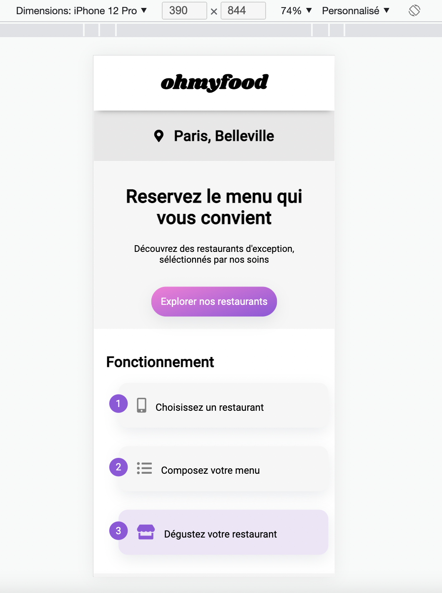

# OHMYFOOD

---------

## Projet 3 de la formation Développeur Web d'OpenClassrooms

> Pour ce projet, j'ai :

* Utilisé HTML5 et CSS3
* Installé node.js
* Installé sass
* Créé un fichier package.json avec la commande npm init
* Intégré un script pour lancer sass plus facilement à chaque ouverture de session
* Utilisé sass, les mixins, les variables, et l'imbrication
* Créé des animations CSS
* Créé un README.md

Bonne visite à tous !

---------

[OHMYFOOD-par-Edwin-Dervaux](https://neodwin.github.io/EdwinDervaux_3_21012022/index.html)

